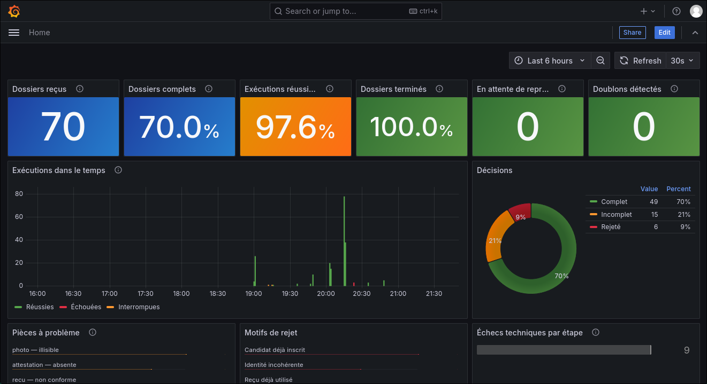
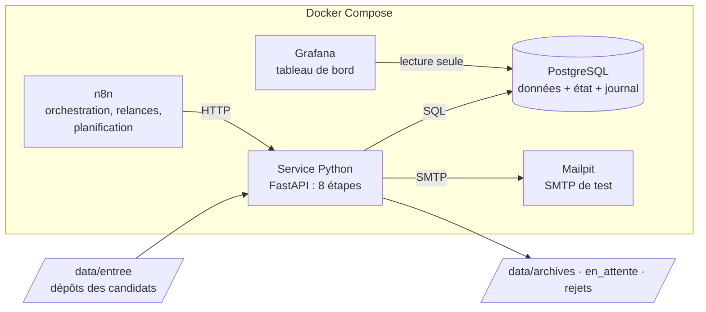
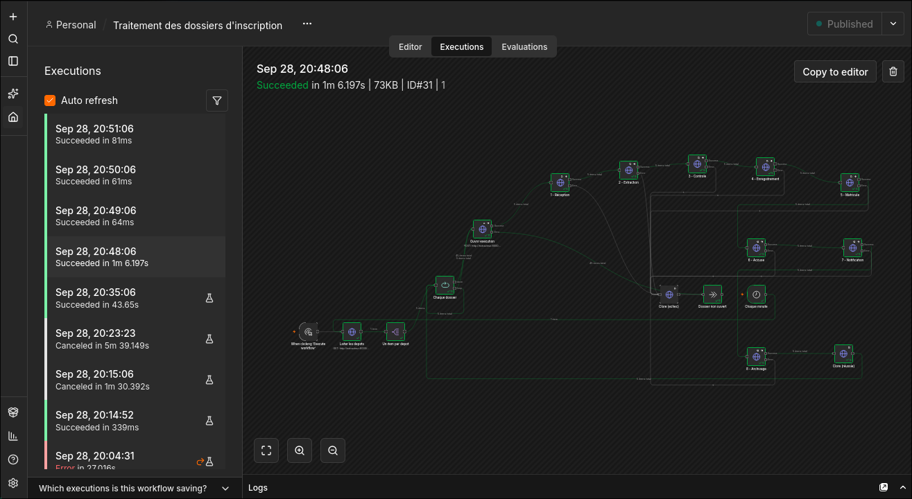

# Chaîne d'automatisation fiable des dossiers d'inscription

Traitement automatisé des dossiers de nouveaux étudiants d'une université
(fictive) : réception des pièces, extraction, contrôle, attribution du
matricule, accusé de réception, e-mail au candidat et archivage.

**Automatiser est facile ; automatiser de façon fiable ne l'est pas.** Ce projet
s'intéresse à ce qui se passe quand ça casse : serveur mail en panne, service
arrêté, réseau coupé, fichier corrompu, processus tué en plein traitement.
L'objectif : qu'aucune de ces pannes ne fasse perdre un dossier, ne crée un
doublon, ni ne passe inaperçue.



> Toutes les données sont fictives et générées par script. Projet local, livré
> comme une maquette complète et documentée : le déploiement en production est
> volontairement hors périmètre.

---

## Résultats

| Test | Résultat |
|------|----------|
| Flux n8n comparé aux décisions attendues (70 dossiers, dont 35 % avec erreurs volontaires) | **70 / 70 décisions conformes**, 0 doublon |
| Serveur mail coupé pendant le traitement dans n8n, puis rétabli | Reprise à l'étape 7 sur 8, **0 e-mail en double** |
| Campagne de pannes : 120 dossiers, 5 pannes provoquées (*) | **120 / 120 dossiers terminés et conformes** |
| — dont exécutions réussies du premier coup | 96,8 % (les autres ont été reprises automatiquement) |
| — échecs techniques absorbés par les relances | 11 |
| — doublons en base / e-mails envoyés en double | **0 / 0** |
| — dépôts traités avant la fin de leur copie | 0 sur 20 |
| Même dossier déposé 6 fois et traité simultanément | 1 complet, 5 rejetés, 0 doublon |
| 300 PDF abîmés au hasard | tous lus ou déclarés illisibles, aucun plantage |

(*) Campagne exécutée avec le simulateur Python comme orchestrateur ;
`make campagne` la rejoue avec n8n et écrit son rapport dans
[`docs/resultats/`](docs/resultats/).

**La lecture clé :** une panne fait baisser le taux de réussite *au premier
coup*, mais pas le taux de dossiers *terminés*, qui reste à 100 %, et les
doublons restent à 0.

---

## Architecture



| Composant | Rôle |
|-----------|------|
| **n8n** (auto-hébergé) | Orchestre : liste les dépôts chaque minute, traite chaque dossier dans une boucle, relance les étapes en échec, isole les erreurs |
| **Service Python** (FastAPI) | Exécute les 8 étapes ; chacune est idempotente et reprenable |
| **PostgreSQL 16** | Données métier, état d'avancement de chaque étape, journal complet |
| **Mailpit** | Serveur SMTP de test : e-mails visibles dans une interface web |
| **Grafana** | Tableau de bord : activité, décisions, causes d'échec, reprises |
| **Docker Compose** | Toute la pile se lance en une commande |

### Les 8 étapes d'un dossier

| # | Étape | Ce qu'elle fait |
|---|-------|-----------------|
| 1 | Réception | Repère le dépôt, calcule l'empreinte SHA-256 de chaque pièce |
| 2 | Extraction | Lit les PDF, vérifie l'intégrité de la photo |
| 3 | Contrôle | Complétude, cohérence des identités, reçu non réutilisé, candidat non déjà inscrit |
| 4 | Enregistrement | Crée ou retrouve le candidat, fixe la décision : complet, incomplet ou rejeté |
| 5 | Matricule | Attribue le matricule (dossiers complets) |
| 6 | Accusé | Génère l'accusé de réception PDF |
| 7 | Notification | E-mail au candidat : confirmation, pièces manquantes ou rejet |
| 8 | Archivage | Range le dossier dans `archives/`, `en_attente/` ou `rejets/` |



---

## Comment la fiabilité est obtenue

**Idempotence : relancer ne crée jamais de doublon.** Chaque effet est
rattaché à une clé protégée par une contrainte `UNIQUE` : référence du dépôt,
empreinte des pièces, identité normalisée du candidat, numéro de reçu, clé
d'e-mail. L'attribution du matricule verrouille le dossier : 20 appels
simultanés donnent un seul matricule.

**Reprise partielle : on repart là où on s'est arrêté.** L'état de chaque
étape est stocké par dossier. À la relance, la base répond pour chaque étape
« déjà faite » (on la saute) ou « à faire ». Un dossier interrompu à l'étape 7
reprend à l'étape 7.

**Travail et état dans la même transaction.** Une étape et son passage à
« terminée » sont validés ensemble, ou pas du tout.

**Effets hors base rendus rejouables.** Un rollback n'annule ni un fichier ni
un e-mail :

| Effet | Technique |
|-------|-----------|
| Accusé PDF | Écriture dans un fichier temporaire puis renommage atomique |
| Archivage | Déplacement fichier par fichier : une relance termine le travail |
| E-mail | Clé réservée sous verrou, confirmée après envoi |
| Dépôt en cours de copie | Marqueur `.pret` écrit en dernier : sans lui, rien n'est traité |

**Panne technique ou décision métier ?** Une pièce illisible ou un reçu déjà
utilisé n'est pas une panne : c'est une décision, enregistrée et expliquée au
candidat. Seules les pannes techniques (base, disque, SMTP, réseau) sont
relancées. Le service le signale par ses codes HTTP : `503` = relancer,
`409` = refusé dans l'état actuel, ne pas relancer.

**Exécutions concurrentes.** Une seule exécution à la fois par dossier (verrou
PostgreSQL). Une exécution tuée est détectée après un délai et le dossier
réapparaît pour être repris. Les courses entre dossiers différents (même reçu,
même candidat) sont arbitrées par la base.

**Rien ne passe inaperçu.** Chaque exécution et chaque étape sont journalisées
avec l'erreur rencontrée ; le tableau de bord montre les échecs, les reprises
et les dossiers en attente.

Détails : [`docs/architecture.md`](docs/architecture.md) · Démo : [`docs/scenario-demo.md`](docs/scenario-demo.md).

---

## Démarrage

Prérequis : Docker et Docker Compose, Python 3.10+ (scripts sans dépendance).

```bash
git clone https://github.com/Toky245/admission-pipeline.git
cd admission-pipeline
cp .env.example .env        # puis changer les mots de passe
make demarrer               # PostgreSQL, n8n, service Python, Mailpit
make tester                 # tests d'idempotence, de reprise et de concurrence
make tableau                # Grafana (optionnel)
```

**Installer le flux n8n** : ouvrir http://localhost:5678, créer le compte
propriétaire, puis *Create workflow* → menu `...` → *Import from File* →
`n8n/workflows/traitement_dossiers.json` → **Publish**.

| Service | Adresse |
|---------|---------|
| n8n | http://localhost:5678 |
| Service Python (documentation de l'API) | http://localhost:8000/docs |
| Mailpit | http://localhost:8025 |
| Grafana | http://localhost:3000 |

## Utilisation

```bash
make generer N=50     # 50 faux dossiers, dont ~35 % avec une erreur volontaire
                      # n8n les traite à son prochain passage (chaque minute)
make verifier         # compare chaque décision au résultat attendu
```

Sortie de `make verifier` :

```
Dossiers attendus : 70   traités : 70
Décisions : incomplet 15, complet 49, rejete 6
Décisions conformes : 70 / 70
Doublons en base : 0
E-mails reçus : 8   envoyés en double : 0
RÉSULTAT : conforme
```

Erreurs volontaires du générateur : pièce manquante, photo tronquée, PDF
corrompu, montant du reçu insuffisant, identité incohérente entre les pièces,
reçu réutilisé, candidat qui redépose un dossier, et variations d'écriture
(casse, accents, espaces) qui ne doivent **pas** provoquer de rejet.

### Provoquer une panne à la main

```bash
make generer N=3
docker compose stop mailpit       # le serveur mail tombe
# n8n : 3 essais espacés de 5 s, puis l'échec est enregistré
docker compose start mailpit
# au passage suivant : étapes 1 à 6 sautées, 7 et 8 exécutées
make verifier                     # 0 e-mail en double
```

### Campagne de pannes

```bash
echo "DUREE_VERROU_MINUTES=2" >> .env && make demarrer   # reprises rapides
make vider                                              # base propre, n8n conservé
make campagne N_CAMPAGNE=300
```

Six vagues de dossiers ; chaque panne démarre **avant** sa vague, pour que les
dossiers arrivent sur un système en panne :

| Vague | Panne provoquée |
|-------|-----------------|
| 1 | aucune (référence) |
| 2 | serveur mail arrêté 90 s |
| 3 | service de traitement arrêté 60 s |
| 4 | service déconnecté du réseau Docker 60 s |
| 5 | dépôts « en cours de copie » : marqueur `.pret` posé 40 s après |
| 6 | `kill -9` du service, de PostgreSQL puis de n8n, pendant un traitement |

Le rapport (Markdown + suivi CSV toutes les 5 s) est écrit dans
`docs/resultats/` : dossiers terminés, décisions conformes, doublons, temps
de rétablissement après chaque panne, délais de traitement, comparaison avec
un traitement manuel.

## Commandes

| Commande | Rôle |
|----------|------|
| `make demarrer` | Lance la pile |
| `make tableau` | Lance Grafana |
| `make generer N=…` | Dépose N faux dossiers |
| `make verifier` | Compare les décisions aux résultats attendus |
| `make simuler` | Traite les dépôts sans n8n (orchestrateur de référence) |
| `make campagne` | Campagne de pannes chiffrée |
| `make tester` | Tests SQL : idempotence, reprise, concurrence |
| `make migrer` | Applique les migrations SQL (rejouables) |
| `make vider` | Efface les données du projet (n8n conservé) |
| `make aide` | Liste toutes les commandes |

## API du service

| Méthode | Route | Rôle |
|---------|-------|------|
| GET | `/depots` | Dépôts nouveaux et dossiers à reprendre |
| POST | `/executions` | Ouvre une exécution (verrou par dossier) |
| POST | `/dossiers/{reference}/etapes/{etape}` | Exécute une étape |
| POST | `/executions/{id}/terminer` | Clôt l'exécution |
| GET | `/bilan` | État des dossiers et doublons |
| GET | `/metriques` | Compteurs instantanés |
| GET | `/sante` | État du service |

## Structure du dépôt

```
db/
  init/          schéma créé au premier démarrage
  migrations/    évolutions du schéma, rejouables
  tests/         tests d'idempotence, de reprise et de concurrence
services/
  extracteur/    service Python : les 8 étapes
n8n/workflows/   flux n8n exporté
grafana/         source de données et tableau de bord, installés automatiquement
scripts/         générateur, simulateur, vérification, campagne de pannes
docs/            architecture, captures, rapports de campagne
data/            dépôts et archives (non versionnés)
```

## Limites connues

- **E-mail « au moins une fois ».** Si le processus meurt exactement entre
  l'envoi SMTP et sa confirmation en base, une relance peut renvoyer l'e-mail.
  La fenêtre est de quelques millisecondes ; elle est documentée et mesurée
  (0 doublon observé), pas cachée.
- **Documents générés.** Les PDF ont un texte extractible ; des scans
  manuscrits demanderaient de l'OCR.
- **Une seule instance.** Un seul service et un seul n8n ; la montée en charge
  horizontale n'est pas traitée.
- **Local.** Pas d'authentification sur le service ni de HTTPS : les ports ne
  sont exposés que sur `127.0.0.1`.

## Pistes d'amélioration

- Alerte (e-mail ou Slack) quand les échecs d'un même type se répètent.
- Portail de dépôt web pour les candidats à la place du dossier partagé.
- OCR des pièces scannées.
- Déploiement sur un serveur avec HTTPS et sauvegardes de la base.

---

## Contexte

Projet réalisé comme implémentation de référence d'un sujet de stage
(« Conception et réalisation d'une chaîne d'automatisation de processus
documentaires avec reprise sur erreur et traçabilité »), afin d'encadrer le
stagiaire en ayant rencontré soi-même chaque difficulté.

## Auteur

**Toky Aroniaina** — développeur et designer UI/UX, Fianarantsoa, Madagascar

[LinkedIn](https://linkedin.com/in/toky-aroniaina) ·
[Portfolio](https://toky-aroniaina.vercel.app/) ·
[GitHub](https://github.com/Toky245)
