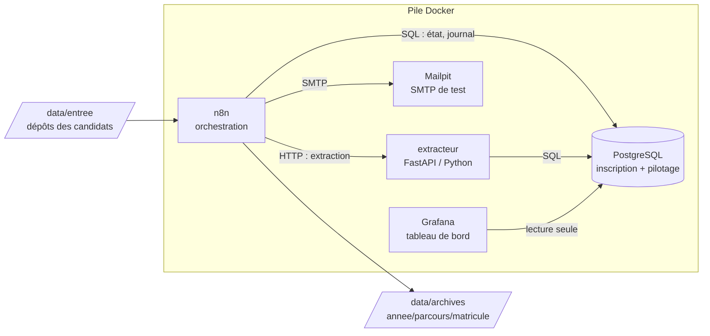

# Architecture

## Vue d'ensemble

## Les étapes d'un dossier

| Ordre | Étape            | Ce qu'elle fait                                              | Clé d'idempotence            |
|-------|------------------|--------------------------------------------------------------|------------------------------|
| 1     | `reception`      | Repère le dépôt, calcule l'empreinte SHA-256 de chaque pièce | `dossiers.reference`, `(dossier, type, sha256)` |
| 2     | `extraction`     | Lit les PDF et extrait les données                            | résultat stocké par étape    |
| 3     | `controle`       | Complétude, cohérence des noms, reçu non réutilisé            | `recus_paiement.numero`      |
| 4     | `enregistrement` | Crée ou retrouve le candidat, met à jour le dossier           | `candidats.cle_identite`     |
| 5     | `matricule`      | Attribue le matricule                                         | `attribuer_matricule()` verrouillée |
| 6     | `accuse`         | Génère l'accusé de réception PDF                              | nom de fichier = matricule   |
| 7     | `notification`   | E-mail : confirmation, pièces manquantes ou rejet             | `notifications.cle`          |
| 8     | `archivage`      | Déplace vers `archives/`, `en_attente/` ou `rejets/`          | chemin cible déterministe    |

## Contrat d'une étape

Chaque appel `POST /dossiers/{reference}/etapes/{etape}` suit le même
déroulé (`services/extracteur/app/etapes.py`) :

1. **Garde-fous** : l'exécution appelante doit être ouverte et rattachée au
   dossier, et toutes les étapes précédentes doivent être terminées (sinon 409).
2. **Faut-il la faire ?** `debuter_etape()` répond. Une étape déjà terminée
   est *sautée* et son résultat renvoyé.
3. **Travail + état dans la même transaction** : l'étape et son passage à
   « terminée » sont validés ensemble, ou pas du tout.
4. **Trois issues** :
   - *terminée* : travail fait ;
   - *ignorée* : ne s'applique pas (pas de matricule pour un dossier incomplet) ;
   - *échouée* : panne technique, réponse 503, l'orchestrateur relance.

Un problème **métier** (pièce illisible, reçu réutilisé) n'est jamais une
panne : c'est une décision enregistrée. Seules les pannes techniques
(base, disque, SMTP) sont relancées.

## Effets de bord hors base

Un rollback n'annule ni un fichier écrit ni un e-mail envoyé. Chacun est
donc conçu pour être rejouable :

| Effet                | Technique                                                        |
|----------------------|------------------------------------------------------------------|
| Accusé PDF           | Écriture dans un fichier temporaire puis renommage atomique      |
| Archivage            | Déplacement fichier par fichier : une relance finit le travail   |
| E-mail               | Clé d'idempotence réservée sous verrou, confirmée après envoi     |
| Dépôt en cours de copie | Marqueur `.pret` écrit en dernier : sans lui, pas de traitement |

## Exécutions concurrentes

`POST /executions` prend un verrou consultatif PostgreSQL sur la référence
et refuse (409) si une autre exécution traite déjà le dossier. Une
exécution sans nouvelle depuis `DUREE_VERROU_MINUTES` est considérée comme
morte (arrêt brutal) : elle est marquée `interrompue` et le dossier
réapparaît dans `/depots` pour être repris.

Les courses entre dossiers différents (deux dépôts avec le même reçu, ou
du même candidat) sont arbitrées par la base à l'enregistrement : la
contrainte d'unicité du reçu et le verrou sur la ligne du candidat
garantissent qu'un seul dossier devient complet.

## Tests réalisés (phase 2)

| Scénario                                             | Résultat                                  |
|------------------------------------------------------|-------------------------------------------|
| 100 dossiers, 35 % d'erreurs, 4 en parallèle          | 100/100 décisions conformes, 0 doublon    |
| 80 dossiers, 60 % d'erreurs, 8 en parallèle           | 80/80 conformes, 0 e-mail en double       |
| Même dossier déposé 6 fois, traité simultanément      | 1 complet, 5 rejetés, 0 doublon           |
| Arrêt brutal pendant la notification                  | Reprise à l'étape 7, 1 seul e-mail        |
| Serveur SMTP indisponible                             | 503, étape échouée, réussie à la relance  |
| Relance complète d'un dossier terminé                 | 8 étapes sautées, 0 e-mail                |
| 300 PDF abîmés au hasard                              | Tous lus ou déclarés illisibles, 0 plantage |
| Référence `../../etc`                                 | Refusée (404)                             |

## Les deux mécanismes centraux

### Idempotence

Chaque effet de bord est rattaché à une clé naturelle protégée par une
contrainte `UNIQUE`. Relancer une étape sur la même donnée ne produit
donc jamais un second enregistrement, un second matricule ou un second
e-mail.

Cas particulier des e-mails : l'envoi SMTP ne peut pas être annulé. Le
flux **réserve** d'abord la clé (`reserver_notification`), envoie, puis
**confirme** (`confirmer_notification`). Si le flux meurt entre l'envoi et
la confirmation, un doublon reste possible : c'est la limite connue de
toute livraison « au moins une fois ». Elle est mesurée pendant la
campagne de pannes au lieu d'être cachée.

### Reprise partielle

L'état de chaque étape est stocké **par dossier** dans
`pilotage.etapes_dossier`. À chaque relance, le flux appelle
`debuter_etape()` qui répond :

- `a_faire = false` : étape déjà terminée, on la saute et on réutilise
  son `resultat` ;
- `a_faire = true` : on l'exécute, le compteur de tentatives augmente.

Un dossier interrompu à l'étape 6 reprend donc à l'étape 6.

## Choix techniques

- **Deux bases** : `admission` (données du projet) et `n8n` (données
  internes de l'orchestrateur), pour ne jamais mélanger les deux.
- **Fonctions SQL avec `search_path` fixé** : elles se comportent de la
  même façon quel que soit le client qui les appelle.
- **Grafana en lecture seule** : compte PostgreSQL dédié sans droit
  d'écriture.
- **Ports exposés sur 127.0.0.1 uniquement** : rien n'est accessible
  depuis le réseau local.
- **Réseau Docker nommé `ap-reseau`** : la campagne de pannes le coupe
  volontairement pour simuler une panne réseau.
