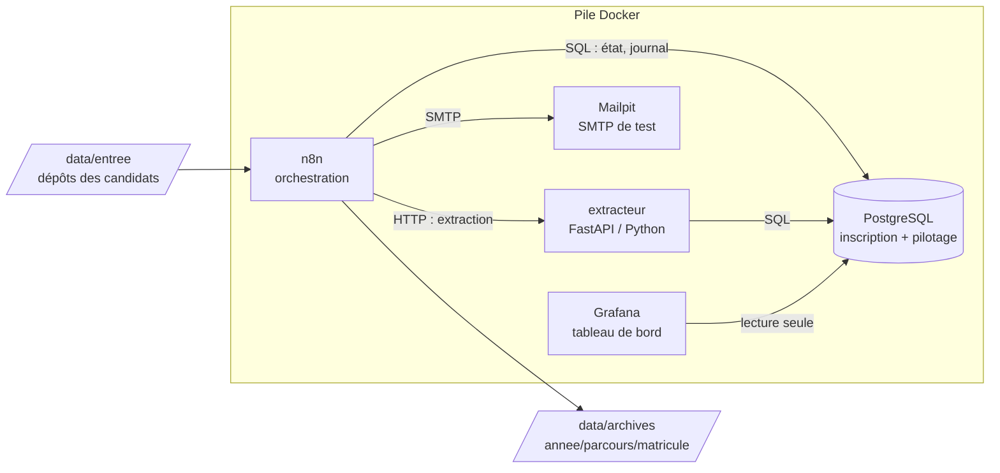

# Architecture

## Vue d'ensemble

## Les étapes d'un dossier

| Ordre | Étape            | Ce qu'elle fait                                              | Clé d'idempotence            |
|-------|------------------|--------------------------------------------------------------|------------------------------|
| 1     | `reception`      | Repère le dépôt, calcule l'empreinte SHA-256 de chaque pièce | `dossiers.reference`, `(dossier, type, sha256)` |
| 2     | `extraction`     | Lit les PDF et extrait les données                            | résultat stocké par étape    |
| 3     | `controle`       | Complétude, cohérence des noms, reçu non réutilisé            | `recus_paiement.numero`      |
| 4     | `enregistrement` | Crée ou retrouve le candidat, met à jour le dossier           | `candidats.cle_identite`     |
| 5     | `matricule`      | Attribue le matricule                                         | `attribuer_matricule()` verrouillée |
| 6     | `accuse`         | Génère l'accusé de réception PDF                              | nom de fichier = matricule   |
| 7     | `notification`   | Envoie l'e-mail au candidat                                   | `notifications.cle`          |
| 8     | `archivage`      | Déplace le dossier vers `archives/`                           | chemin cible déterministe    |

## Les deux mécanismes centraux

### Idempotence

Chaque effet de bord est rattaché à une clé naturelle protégée par une
contrainte `UNIQUE`. Relancer une étape sur la même donnée ne produit
donc jamais un second enregistrement, un second matricule ou un second
e-mail.

Cas particulier des e-mails : l'envoi SMTP ne peut pas être annulé. Le
flux **réserve** d'abord la clé (`reserver_notification`), envoie, puis
**confirme** (`confirmer_notification`). Si le flux meurt entre l'envoi et
la confirmation, un doublon reste possible : c'est la limite connue de
toute livraison « au moins une fois ». Elle est mesurée pendant la
campagne de pannes au lieu d'être cachée.

### Reprise partielle

L'état de chaque étape est stocké **par dossier** dans
`pilotage.etapes_dossier`. À chaque relance, le flux appelle
`debuter_etape()` qui répond :

- `a_faire = false` : étape déjà terminée, on la saute et on réutilise
  son `resultat` ;
- `a_faire = true` : on l'exécute, le compteur de tentatives augmente.

Un dossier interrompu à l'étape 6 reprend donc à l'étape 6.

## Choix techniques

- **Deux bases** : `admission` (données du projet) et `n8n` (données
  internes de l'orchestrateur), pour ne jamais mélanger les deux.
- **Fonctions SQL avec `search_path` fixé** : elles se comportent de la
  même façon quel que soit le client qui les appelle.
- **Grafana en lecture seule** : compte PostgreSQL dédié sans droit
  d'écriture.
- **Ports exposés sur 127.0.0.1 uniquement** : rien n'est accessible
  depuis le réseau local.
- **Réseau Docker nommé `ap-reseau`** : la campagne de pannes le coupe
  volontairement pour simuler une panne réseau.
